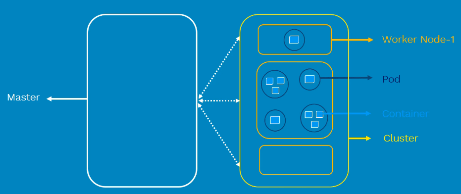
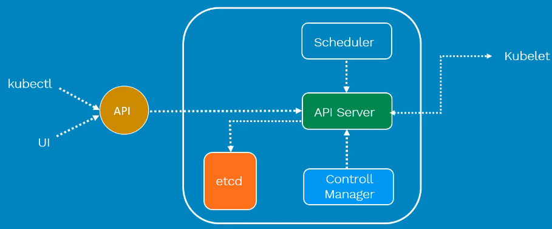
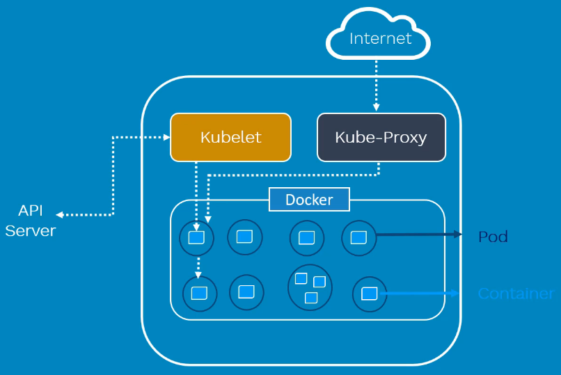
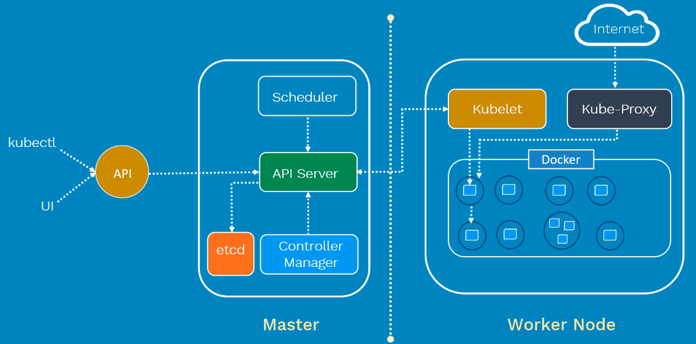

# Kubernetes

Kubernetes, also known as K8s, is an open-source system for automating deployment, scaling, and management of containerized applications.

## Kubernetes Overview

## Kubernetes Master

## Kubernetes Worker Node (Minion)

## Now let us combine Master & Worker Node

## Kubernetes Cluster

