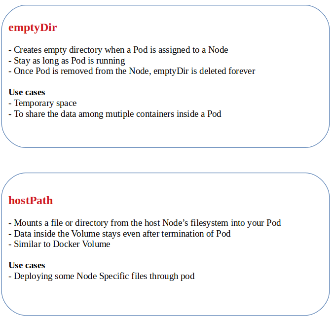

# Storage

#### Pods are ephemeral and stateless
* How can data persist throughout lifecycle of Pod?
* How can data persist beyond life-cycle of Pod?
* How can containers share files between containers in Pod?

### Volumes bring persistence to Pod

#### Advantages of Kubernetes Volumes vs. Docker Volumes
* Once we attach Volume to a Pod, all the containers running in that Pod has access to it
* Volumes are associated with Lifecycle of Pod. But in Docker Volumes are associated with Lifecycle of Container
* When containers in Docker restarts, Data inside the Volume will be erased where as in Pod data is preserved across container restarts
* Kubernetes supports multiple volume types

#### Volume Types

* Kubernetes supports different volume types

<table>
  <tr><td><b>Ephemeral</b></td><td>Same lifetime as pods</td></tr>
  <tr><td><b>Durable</b></td><td>Beyond pods lifetime</td></tr>
</table>

<table>
<tr><td>awsElasticBlockStore</td><td>fc (fibre channel)</td><td>nfs</td></tr>
<tr><td>azureDisk</td><td>flocker</td><td>persistentVolumeClaim</td></tr>
<tr><td>azureFile</td><td>gcePersistentDisk</td><td>projected</td></tr>
<tr><td>cephfs</td><td>gitRepo</td><td>portworxVolume</td></tr>
<tr><td>configMap</td><td>glusterfs</td><td>quobyte</td></tr>
<tr><td>csi</td><td>hostPath</td><td>rbd</td></tr>
<tr><td>downwardAPI</td><td>iscsi</td><td>scaleIO</td></tr>
<tr><td>emptyDir</td><td>local</td><td>secret</td></tr>
<tr><td>vsphereVolume</td><td>storageos</td><td>   </td></tr>
<table>  

