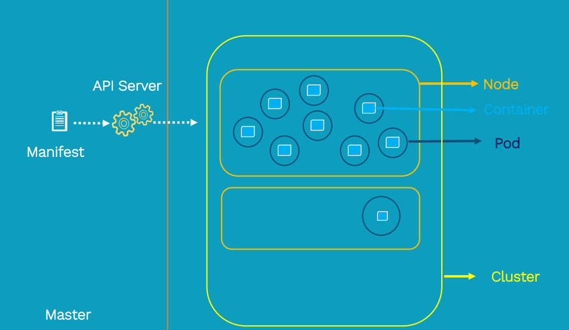
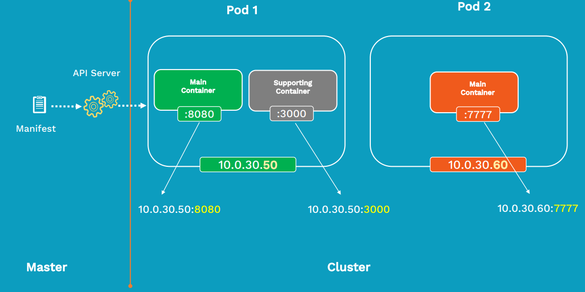

# Pods

Pods are the smallest units of deployment in Kubernetes

## Pod deployment

## Pod Networking

* Along with the Node, every Pod inside a Kubernetes cluster get its unique IP address

* How the containers inside the Pod communicate with each other?
  * All the containers within a given Pod belong to same namespace and so they share the same IP Address
  * So port is used to identfy each container uniquely within the container

